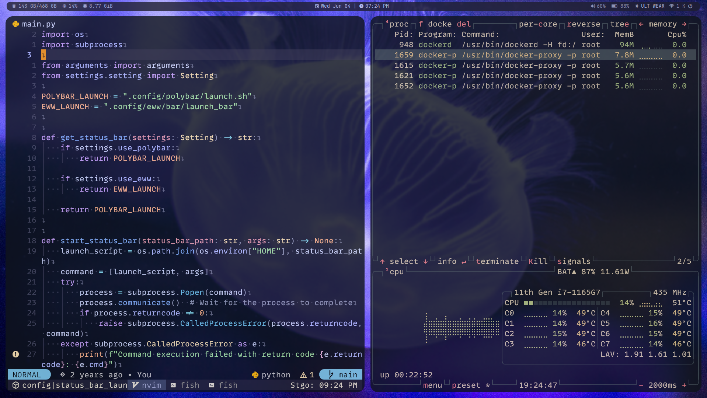
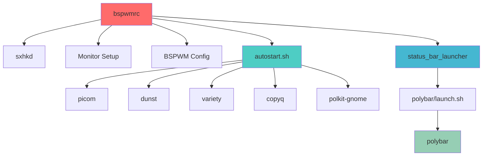

# 🎨 **dotfiles** – My Arch Linux Development Environment

Welcome to my **dotfiles**! 🎉
A carefully crafted collection of configurations for my Arch Linux setup, featuring a beautiful and efficient tiling window manager environment.



---
## 🚀 **Key Features**
✨ **Optimized configurations** for:
- **Terminal** (Kitty + Fish shell)
- **Window Management** (BSPWM + sxhkd)
- **Status & Notifications** (Polybar + Dunst)
- **Productivity Tools** (Rofi, Tmux)
- **Development** (Neovim)
- **System Integration** (Picom, Dolphin)

🔧 **One-command installation**
📦 **Modular** – Pick only what you need

---

## 🔄 **System Initialization Flow**



**Component Initialization Order:**
1. **BSPWM** → Window manager configuration
2. **sxhkd** → Keyboard shortcuts daemon
3. **Monitor Setup** → Display configuration
4. **autostart.sh** → System services
   - **picom** → Window compositor
   - **dunst** → Notification daemon
   - **variety** → Wallpaper manager
   - **copyq** → Clipboard manager
5. **status_bar_launcher** → Status bar
   - **polybar** → System status display

---

## 📥 **Installation**

### **Prerequisites**
- Arch Linux
- Git
- Fish shell (optional but recommended)

### **Quick Start**1. Clone the repo:
   ```sh
   git clone https://github.com/yourusername/dotfiles.git ~/.config
   ```2. Enter the directory:
   ```sh
   cd ~/.config
   ```3. Run the installer:
   ```sh
   ./install.sh
   ```   *(Follow prompts to select modules)*

---

## 🧩 **Available Modules**
| Module     | Description                          |
|------------|--------------------------------------|
| **bspwm**  | Tiling window manager configuration  |
| **sxhkd**  | Hotkey daemon for window management  |
| **polybar**| Status bar with system information   |
| **kitty**  | Fast and feature-rich terminal       |
| **fish**   | Smart and user-friendly shell        |
| **tmux**   | Terminal multiplexer with sessions   |
| **neovim** | Modern Vim-based code editor         |
| **rofi**   | Application launcher and tools       |
| **picom**  | Window compositor for effects        |
| **dunst**  | Lightweight notification daemon      |

*(Customize module selection during installation)*

---

## 🛠️ **Customization**

Want to tweak something?
- Edit files in `~/.config/`
- Reinstall to apply changes:
  ```sh
  ./install.sh --update
  ```
---

## ❓ **FAQ**

### **How to uninstall?**
Run:
```sh
./uninstall.sh
```

### **How to contribute?**
Open an **Issue** or **PR**! All contributions are welcome.

---

## 📜 **License**
MIT © [Scarlett Sotelo](https://github.com/ssoteloserrano)

---

💻 **Enjoy a supercharged development workflow!**
Like this project? Leave a ⭐ on GitHub! 🚀

---

*(README last updated: May 2025)*

---

🔗 **Useful Links**:
- [Report an issue](https://github.com/ssoteloserrano/dotfiles/issues)
- [Changelog](CHANGELOG.md)

---

✨ **Happy Coding!** ✨
